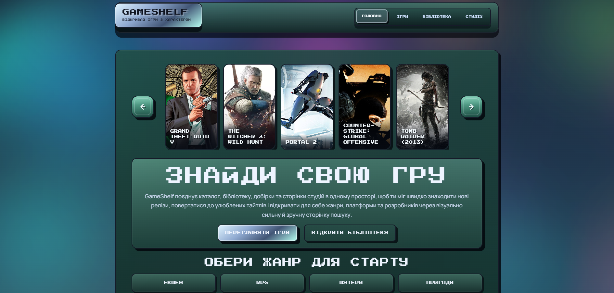
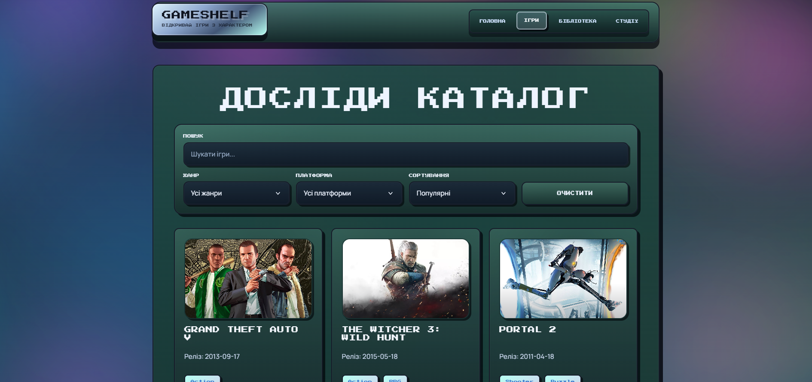
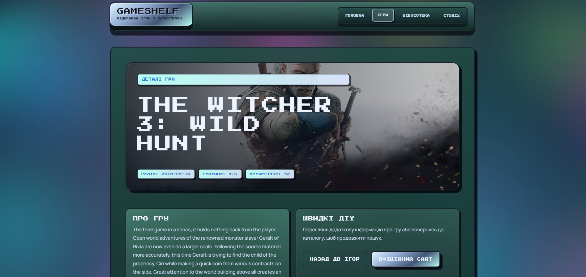
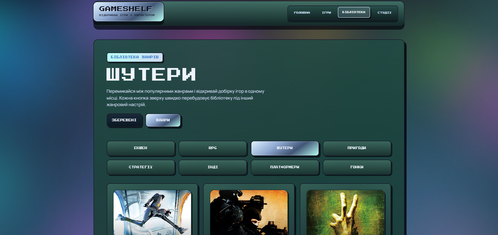
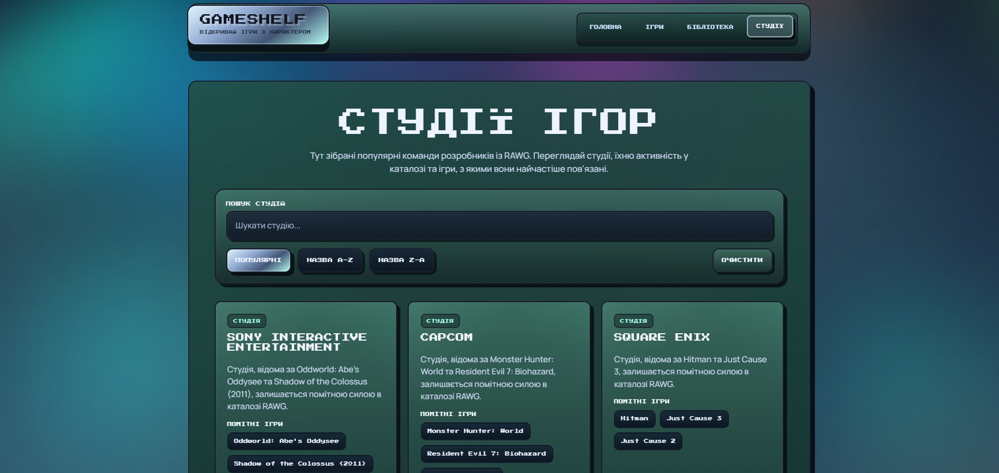

# GameShelf

GameShelf is a retro-styled React application for discovering games, browsing curated selections, exploring studios, and saving favorite titles into a personal library.

Live Demo: [https://vladprotsyshyn.github.io/gameshelf/](https://vladprotsyshyn.github.io/gameshelf/)

---

## English

### Overview

GameShelf is a multi-page front-end application built around the RAWG API.  
The project combines a stylized home page, a searchable games catalog, detailed game pages, a saved library flow, and a studios catalog in one cohesive interface.

### Main Features

- Home page with hero section, game showcase slider, genre shortcuts, and featured studios
- Games catalog with search, genre filter, platform filter, sorting, and load more
- Detailed game page with structured metadata and highlighted content blocks
- Personal library with saved games and genre-based browsing
- Studios page with search, sorting, and incremental loading
- Reusable loading and error UI states across the app
- Local persistence for saved games via context and local storage

### Pages

- Home
- Games
- Game Details
- Library
- Studios
- Not Found

### Tech Stack

- React
- Vite
- React Router
- CSS
- Context API
- Local Storage
- RAWG API

### Environment Variables

Create a `.env` file in the project root:

```env
VITE_RAWG_API_KEY=your_rawg_api_key_here
```

The example file is available in [`.env.example`](./.env.example).

### Run Locally

```bash
npm install
npm run dev
```

Open:

```txt
http://localhost:5173/
```

### Scripts

```bash
npm run dev
npm run build
npm run lint
npm run preview
```

### Project Structure

```txt
src/
  app/
  components/
    icons/
    layout/
    ui/
  data/
  features/
    games/
    home/
    library/
    studios/
  pages/
  services/
  styles/
```

### Screenshots

#### Home



#### Games



#### Game Details



#### Library



#### Studios



### Deployment

- Production build: `npm run build`
- Live Demo: [https://vladprotsyshyn.github.io/gameshelf/](https://vladprotsyshyn.github.io/gameshelf/)
- Deployment: GitHub Pages

---

## Українська

### Опис

GameShelf — це багатосторінковий front-end застосунок у ретро-стилі для пошуку ігор, перегляду добірок, вивчення студій та збереження улюблених тайтлів у власну бібліотеку.

### Основні можливості

- Головна сторінка з hero-блоком, слайдером ігор, жанрами та добіркою студій
- Каталог ігор з пошуком, фільтрами за жанром і платформою, сортуванням та кнопкою `Показати ще`
- Сторінка деталей гри з метаданими та структурованими інформаційними блоками
- Особиста бібліотека зі збереженими іграми та режимом перегляду за жанрами
- Сторінка студій із пошуком, сортуванням і довантаженням елементів
- Спільні стани завантаження та помилки для різних сторінок
- Збереження улюблених ігор через context та local storage

### Сторінки

- Головна
- Ігри
- Деталі гри
- Бібліотека
- Студії
- 404

### Технології

- React
- Vite
- React Router
- CSS
- Context API
- Local Storage
- RAWG API

### Змінні середовища

Створи файл `.env` у корені проєкту:

```env
VITE_RAWG_API_KEY=your_rawg_api_key_here
```

Шаблон доступний у [`.env.example`](./.env.example).

### Локальний запуск

```bash
npm install
npm run dev
```

Потім відкрий:

```txt
http://localhost:5173/
```

### Команди

```bash
npm run dev
npm run build
npm run lint
npm run preview
```

### Структура проєкту

```txt
src/
  app/
  components/
    icons/
    layout/
    ui/
  data/
  features/
    games/
    home/
    library/
    studios/
  pages/
  services/
  styles/
```

### Скріншоти

#### Головна


#### Ігри


#### Деталі гри


#### Бібліотека


#### Студії


### Деплой

- Production build: `npm run build`
- Запланований варіант розгортання: GitHub Pages
